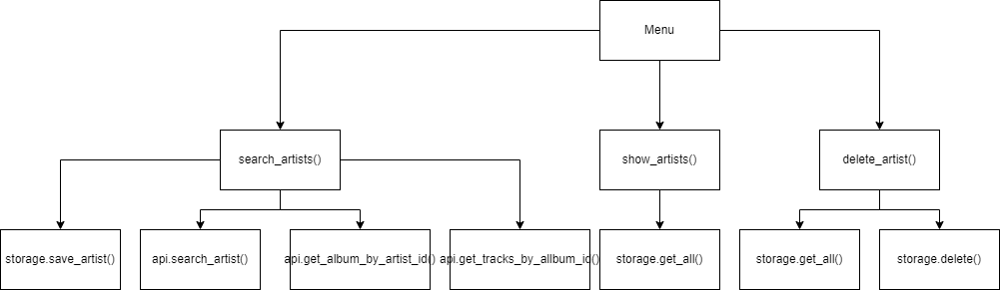

# PyProject 
This project is inspired in the last exercise of the [Calidad y pruebas de Software](https://github.com/schiob/TestingSistemas)
 course: [Practica 6](https://github.com/schiob/TestingSistemas/tree/master/ago-dic-2021/practicas/practica6).

We have to created a terminal application that interacts with the Musixmatch API and the MongoDB database.

The most important is the modularity with which it was created. It allow us test better. 

We can test every isolated business logic and, then, test them together easily.

